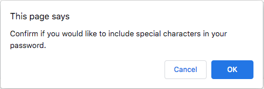
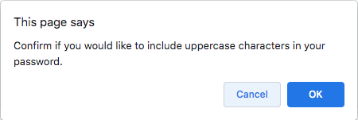
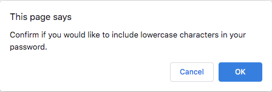
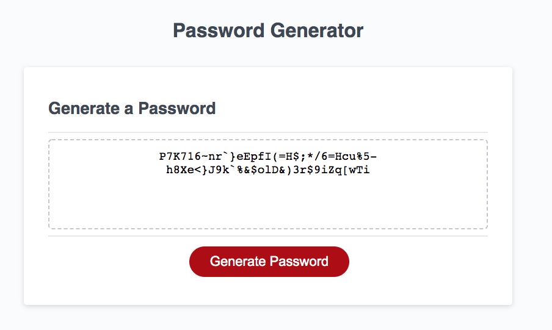

# Javascript_PasswordGenterator_AlexPalmer

1. Description
2. Web Address
3. Usage Tips

Description:

Random password generator

__________________________________________________________________

Generate button

__________________________________________________________________

Enter password length prompt

__________________________________________________________________

Special characters prompt

__________________________________________________________________

Uppercase characters prompt

__________________________________________________________________

Lowercase characters prompt

__________________________________________________________________

Generated password example

__________________________________________________________________

Web Address:
https://apalmer37.github.io/Javascript_PasswordGenterator_AlexPalmer/
https://github.com/apalmer37/Javascript_PasswordGenterator_AlexPalmer

__________________________________________________________________

Usage Tips:
- Click the "Generate Password" button to generate prompts that request you for the following attributes to create a randomly generated password:
1. Enter how many characters you would like your password to be (must be between 8-128). If you enter a number less than 8 or more than 128 then you will restart the password generator.
2. Confirm if you would like numbers in your password.
3. Confirm if you would like special characters in your password.
4. Confirm if you would like uppercase characters in your password.
5. Confirm if you would like lowercase characters in your password.
- You have now generated a random password that you may copy, and use accordingly!

